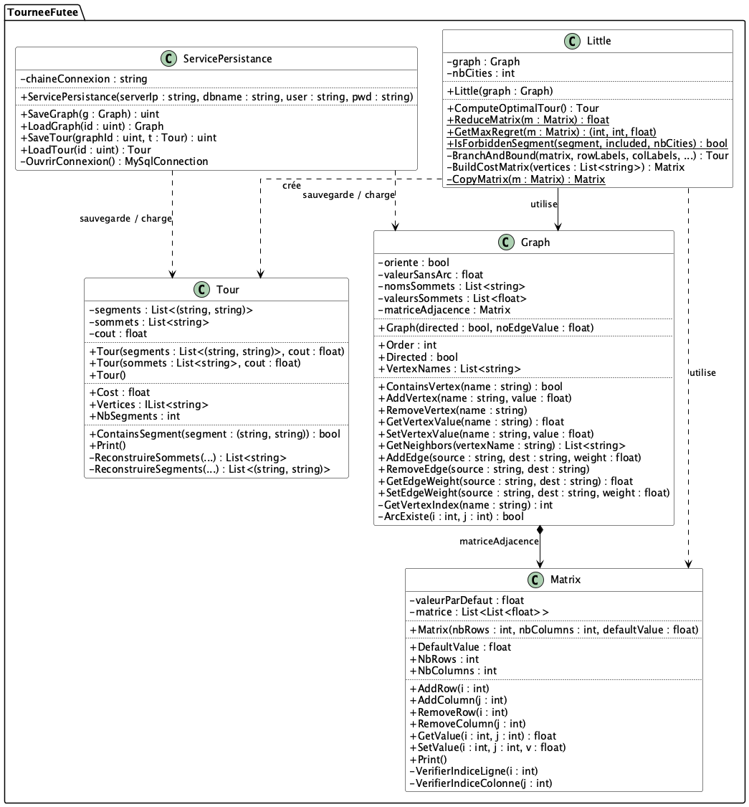

# Objectif 3 — Persistance MySQL en C#

Projet réalisé dans le cadre du module **Problème Scientifique & Informatique (PSI)** (MESIIN240125) à l'ESILV.

L'objectif de ce projet est d'implémenter une couche de persistance MySQL pour sauvegarder et recharger les graphes et les tournées calculés par l'algorithme de Little (Objectif 2).

## Objectifs du projet

- Concevoir et initialiser un **schéma de base de données** MySQL pour les graphes et les tournées
- Implémenter la classe **ServicePersistance** permettant de sauvegarder et charger un graphe et une tournée
- Valider la persistance avec des **tests d'intégration** sur une base MySQL dédiée

## Fonctionnalités

- **SaveGraph** / **LoadGraph** : sérialise un graphe (orienté ou non) en base de données et le reconstruit à l'identique
- **SaveTour** / **LoadTour** : sérialise une tournée (séquence de sommets et coût total) et la reconstruit à l'identique

## Diagramme UML



## Structure du projet

Le projet s'appuie sur les classes des objectifs précédents (`Graph`, `Matrix`, `Tour`, `Little`) et ajoute :

- **ServicePersistance** : accès à la base de données MySQL (connexion, insertion, chargement)
- **init_db.sql** : script de création du schéma de base de données

## Schéma de base de données

| Table | Colonnes principales | Rôle |
|-------|---------------------|------|
| `Graphe` | `id`, `est_oriente` | Un graphe orienté ou non |
| `Sommet` | `id`, `graphe_id`, `nom`, `valeur` | Un sommet du graphe |
| `Arc` | `id`, `graphe_id`, `sommet_source`, `sommet_dest`, `poids` | Un arc entre deux sommets |
| `Tournee` | `id`, `graphe_id`, `cout_total` | Une tournée associée à un graphe |
| `EtapeTournee` | `tournee_id`, `numero_ordre`, `sommet_id` | Un sommet à un rang donné dans la tournée |

Pour un graphe **non orienté**, un seul arc est stocké par paire (source d'indice inférieur → destination), évitant les doublons. `AddEdge` se charge d'ajouter automatiquement l'arc inverse au rechargement.

## Configuration requise

1. Serveur MySQL démarré et accessible (par défaut `127.0.0.1`)
2. Créer la base de test et exécuter le script :

```sql
CREATE DATABASE tourneefutee_test;
USE tourneefutee_test;
SOURCE init_db.sql;
```

3. SDK .NET 8.0
4. Package NuGet `MySql.Data` 8.3.0 (restauré automatiquement via `dotnet restore`)

## Tests d'intégration

Les tests sont dans `AlgoLittle.Tests/PersistanceTests.cs`. Ils interagissent avec une vraie base de données MySQL — adaptez les constantes `DB_*` en tête de fichier si besoin.

Pour lancer les tests :

```bash
dotnet test
```

## Crédits

[voir LICENSE]
